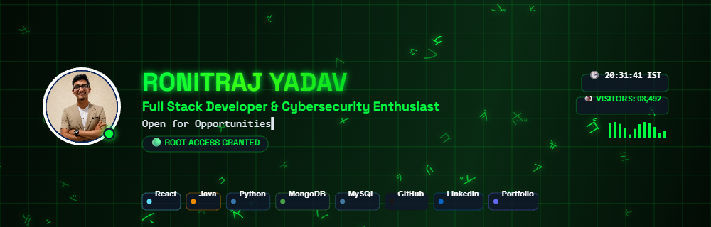

<!-- Animated Profile Banner (Make sure loop is set to infinite) -->

# Hi there, I'm Ronitraj Yadav 👋
### Full Stack Developer • Based in Mumbai, India

> **Status**: 🚀 Open for Opportunities

Designing high-performance web applications, scalable backends, and responsive user experiences.

<!-- Live Visitor Counter -->

<!-- Social Connect Badges -->

<!-- Skills & Tech Stack -->
### 🛠️ Tech Stack & Skills
      

---
*Crafted with BannerStudio Pro 🚀*

<!-- Live Animated Profile Header Component -->

  

    
    

      <h2 style="margin: 0; font-size: 28px; background: linear-gradient(90deg, #818CF8, #C084FC, #E879F9); -webkit-background-clip: text; -webkit-text-fill-color: transparent;">
        Ronitraj Yadav
      </h2>
      
Full Stack Developer

      
🚀 Open for Opportunities

    

  

