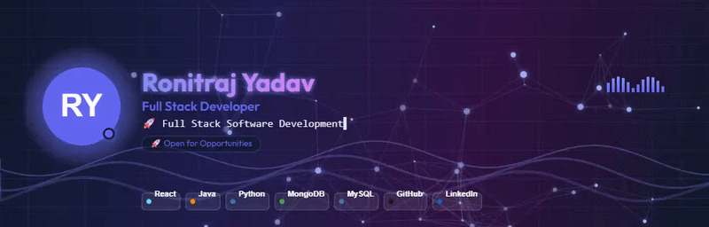

<!-- Animated Header Banner -->

  

# 👋 Hi, I'm RONITRAJ YADAV

### 🚀 Full Stack Developer & Cybersecurity Enthusiast

 

<!-- Digital Portfolio Callout Badge -->

  

<!-- Quick Stats Card with Styled Dark Background -->
<table align="center" width="100%">
  <tr>
    <td align="left" style="background-color: #0d1117; padding: 22px; border-radius: 12px; border: 1px solid #30363d; color: #c9d1d9;">
      <h3 align="center" style="color: #58a6ff; margin-top: 0;">⚡ Quick Stats</h3>
      <ul style="line-height: 1.8;">
        <li>📍 <b>Location</b>: Mumbai, Maharashtra, India</li>
        <li>🎓 <b>Education</b>: MCA Student</li>
        <li>💼 <b>Status</b>: Open to Internships & Full-time Roles</li>
        <li>🌱 <b>Focus</b>: Learning AI, Machine Learning & Cybersecurity</li>
        <li>🚀 <b>Role</b>: Full Stack Developer</li>
      </ul>
    </td>
  </tr>
</table>

 

<!-- About Me Card with Styled Dark Background -->
<table align="center" width="100%">
  <tr>
    <td align="left" style="background-color: #0d1117; padding: 22px; border-radius: 12px; border: 1px solid #30363d; color: #c9d1d9;">
      <h3 align="center" style="color: #238636; margin-top: 0;">🙋 About Me</h3>
      <ul style="line-height: 1.8;">
        <li>🤖 Passionate about AI & Machine Learning</li>
        <li>🔐 Exploring Cybersecurity & Ethical Hacking</li>
        <li>🌍 Love solving real-world complex problems</li>
        <li>📚 Always learning and mastering new technologies</li>
      </ul>
    </td>
  </tr>
</table>

 

<!-- Tech Stack Section -->
### 🛠️ Tech Stack & Skills

#### Frontend

#### Backend

#### Database

#### Tools & DevOps

 

<!-- GitHub Analytics Section -->
### 📊 GitHub Analytics

  
  

  

 

<!-- Achievements Card -->
<table align="center" width="100%">
  <tr>
    <td align="left" style="background-color: #0d1117; padding: 22px; border-radius: 12px; border: 1px solid #30363d; color: #c9d1d9;">
      <h3 align="center" style="color: #d29922; margin-top: 0;">🏆 Achievements</h3>
      <ul style="line-height: 1.8;">
        <li>🏅 Professional Certifications</li>
        <li>📚 Academic Projects</li>
        <li>📜 Research Projects</li>
      </ul>
    </td>
  </tr>
</table>

 

<!-- Connect With Me Section -->
### 📫 Connect With Me

  
  
  
  

 

<!-- Visitor Counter -->

 

---

### ⭐ Thanks for visiting my profile!
**Code • Learn • Build • Repeat 🚀**

